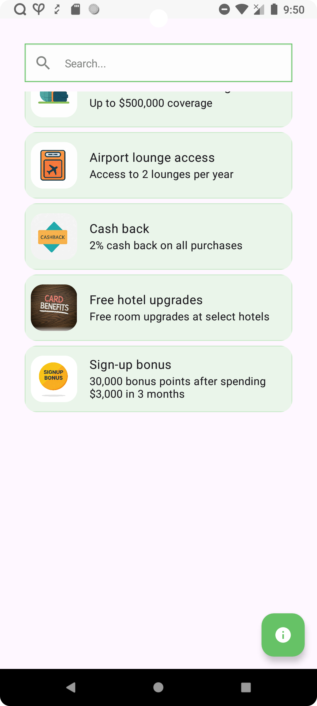

# Card Vault App

Welcome to the Card Vault App! This application helps users to explore and compare the benefits and rewards offered by different credit cards. Whether you’re looking for cashback offers, shopping rewards, lounge access, or other perks, Card Vault helps you make an informed choice.

## Features

1. **Top Carousel**
- Displays the list of available cards and define it's type

2. **Search Functionality**
- Allows users to apply filters to narrow down rewards based on search term..

3. **Card Analysis**
- Users can view the details of the current card.
- Analysis includes:
  - Number of rewards.
  - Top 3 characters based on occurrences.

## How to Use

**Card Browsing**

- Explore a list of available cards categorized by their primary benefits.

**Comparing Rewards**

- List shows details of the selected card like their rewards, fees, and perks.

**Search Functionality**

- Use the search bar to find benefits quickly.

## Libraries Used

- **AndroidX Libraries:**
  -  `androidx.core:core-ktx` - Provides Kotlin extensions for core Android components.
  -  `androidx.appcompat:appcompat` - Adds support for modern Android features on older devices.
  -  `androidx.activity:activity-ktx` - Provides Kotlin extensions for activity-related functions.
  -  `androidx.activity:activity-compose` - This library is s part of the Jetpack Compose toolkit for Android, which provides a modern toolkit for building native Android UIs..
  -  `androidx.lifecycle:lifecycle-runtime-ktx` - Provides Kotlin extensions for lifecycle-aware components.
  -  `androidx.core:core-splashscreen` - Add supports for app based custom splash screen.
  -  `androidx.core:core-ktx` - Provides Kotlin extensions for core Android framework components..
  -  `androidx.lifecycle:lifecycle-runtime-ktx` - Enables lifecycle-aware behavior in your composables..
  -  `androidx.compose.material3:material3-android` - The Material3 Design components library, offering a wide range of pre-built UI elements that adhere to Google's Material Design guidelines, ensuring a visually appealing and user-friendly interface..

androidx.navigation:navigation-compose: This library provides Navigation Component support for Jetpack Compose Applications.

- **Material Design:**
  - `com.google.android.material:material` - Implements Material Design components and themes.

- **Dependency Injection:**
  - `koin-android` - Dependency injection framework for Android.
  - `koin-core` - Core library for dependency injection.

  
## Screenshots

---